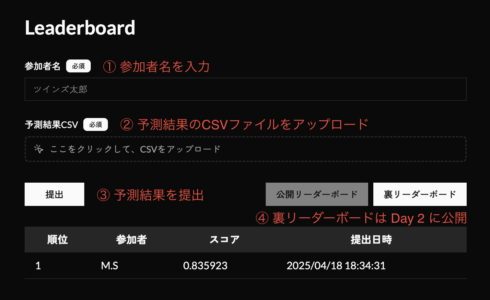

# 2WINS AI Hackathon #1 ｜ 低解像度OCR

## はじめに

2WINS AI Hackathonは、**「勝たせるAI」** で企業の未来を切り拓く、情熱と挑戦にあふれた実践型ハッカソンです。アカデミアの最先端技術とビジネスのリアルを融合し、現実の課題に挑む中で、革新を生み出す力を磨くことを趣旨としています。

## スケジュール

### Day 1　ワークショップ・タスク説明
- 日時：2025年04月18日（金）18:00-20:00
- 場所：2WINS本社

### Day 2　発表会・表彰式
- 日時：2025年04月25日（金）18:00-20:00
- 場所：2WINS本社

## 概要

### 1. タスク説明

本コンペティションは、低解像度の間取り図画像から部屋名を抽出するOCRタスクに取り組みます。画像にはノイズ・歪み・解像度の低さといった実環境に即した困難さが含まれています。

OCR技術に加え、以下のような多様なアプローチが有効とされます：

- 超解像度技術による画質向上
- CNNによる画像分類的アプローチ
- 大規模言語モデル (LLM) を活用したマルチモーダル処理

現実のユースケースを想定した、柔軟かつ実用的なソリューションの開発が期待されます。

### 2. データ

今回の訓練や評価に使用するデータセットは、こちらからダウンロードできます。

https://drive.google.com/drive/folders/1UVDoO2a-svdjEtHxDylM53-OLgufgA_Y?usp=sharing

データセットの構造は以下のようになっています。

```shell
.
├── test      # 評価用データ（1124枚）
│   └── low   # 低解像度の間取り図画像
└── train     # 訓練用データ（4489枚）
    ├── high  # 高解像度の間取り図画像
    └── low   # 低解像度の間取り図画像
```

各フォルダの中には、以下のようなファイルが含まれています（下記は、`クローゼット_1.jpg`というファイル名の画像です）。画像は全て128x128ピクセルの正方形画像で、JPEG形式で保存されています。ファイルの命名規則は、`<ラベル>_<番号>.jpg`となっています。


### 3. 評価指標

Macro F1 Scoreを評価指標として採用します。

> 今回は、一文字単位で完全一致した場合のみ正解と判定。例えば、
>   - 正解が「リビング」で、予測結果が「リビング」の場合 → 正解
>   - 正解が「クローゼット」で、予測結果が「クロゼット」の場合 → 不正解

こちらの提出サイトに予測結果をアップロードすることで、リーダーボードに自分のスコアが反映されます。

https://hackathon.2wins.ai/

提出手順は以下の通りです。
1. 参加者名を入力する
2. 予測結果をCSV形式でアップロードする
3. 提出ボタンを押す
4. リーダーボードにある自分のスコアを確認する
5. （Day 2 以降）裏リーダーボードにある自分のスコアを確認する



提出するCSVファイルのフォーマットは以下のようになっています。実際のサンプルは、[submission.csv](./pred/submission.csv)を参照してください。

```csv
id,label
1.jpg,リビング
2.jpg,寝室
...
```

`id`の列には、`test/low`フォルダ内の評価用画像ファイル名を記載してください。`label`の列には、予測した部屋名を日本語で記載してください（例：「リビング」、「寝室」、「浴室」など）。

「公開リーダーボード」では、全体の評価用データの50%のみを使用してスコアを算出します。最終評価には、評価用データ全体の100%が使用され、その結果が「裏リーダーボード」に反映されます。このコンペティションでは、最終評価のスコアが最も高いチームが優勝となります。

注意事項として、
- 外部APIの利用は可能（有料APIも可）
- 再現性は不要
- ハンドラベリングは禁止
- チーム外との情報共有は可能
- ハッカソン終了時には最終提出ファイルを作成したコードを全て提出していただきます

### 4. 考えられる手法

1. CNN (Convolutional Neural Networks)
    - 例：SimpleCNN、ResNet、EfficientNet
    - 特徴：OCRを経由せず、部屋名をラベルとして分類する高速・軽量な手法
2. OCRモデル
    - 例：Tesseract、EasyOCR、PaddleOCR
    - 特徴：文字検出 + 認識で部屋名を抽出。文字列処理に特化
3. 超解像度化 (Super-Resolution)
    - 例：SRCNN、EDSR、Real-ESRGAN
    - 特徴：画像の高解像度化により、OCRやCNNの精度向上を狙う
4. LLM・マルチモーダルモデル
    - 例：GPT-4V、Gemini、Claude 3
    - 特徴：画像を直接入力し、プロンプトに応じて部屋名を出力可能

## サンプルコード

### 0. プロジェクト構成

```shell
<プロジェクトディレクトリ>
├── README.md    # このファイル
├── LICENSE      # ライセンス
├── checkpoints  # 学習済モデルの保存先
├── data         # データセット（上記指示に従ってダウンロードする必要があります）
│   ├── test
│   │   └── low
│   └── train
│       ├── high
│       └── low
├── docs         # ドキュメント
├── models       # モデル定義
├── pred         # 推論結果
├── requirements.txt
├── train.py     # 実行スクリプト
└── utils        # 補助関数（データローダー等）
```

### 1. 環境構築

```shell
pip install -r requirements.txt
```

### 2. 訓練と推論

```shell
python train.py
```

実行により以下が行われます：

- データ読み込み・前処理
- Stratified Split による訓練/検証分割
- モデル学習・保存（checkpoints/model_final.pth）
  - モデル概要（SimpleCNN）
    - 入力：128×128ピクセル、グレースケール画像
    - 構成：
      - Conv2d + ReLU + MaxPool を3層
      - Flatten → 全結合層（16384 → 128）
      - 出力層（128 → 10）で10クラス分類
      - 出力は Softmax を通じて部屋名分類
- テスト画像への推論
- 結果出力（pred/submission.csv）

## お問い合わせ

バグ報告・質問等はSlackにてお願いします。

## ライセンス
This project is licensed under the [Mozilla Public License 2.0 (MPL-2.0)](./LICENSE), which permits use, modification, and distribution under its terms. It also includes third-party components licensed under the [Apache License 2.0](https://www.apache.org/licenses/LICENSE-2.0).  

For proprietary or closed-source use cases—such as keeping modifications private, avoiding MPL obligations, or requiring commercial support—please contact [info@2wins.ai](mailto:info@2wins.ai) to explore alternative licensing options.
